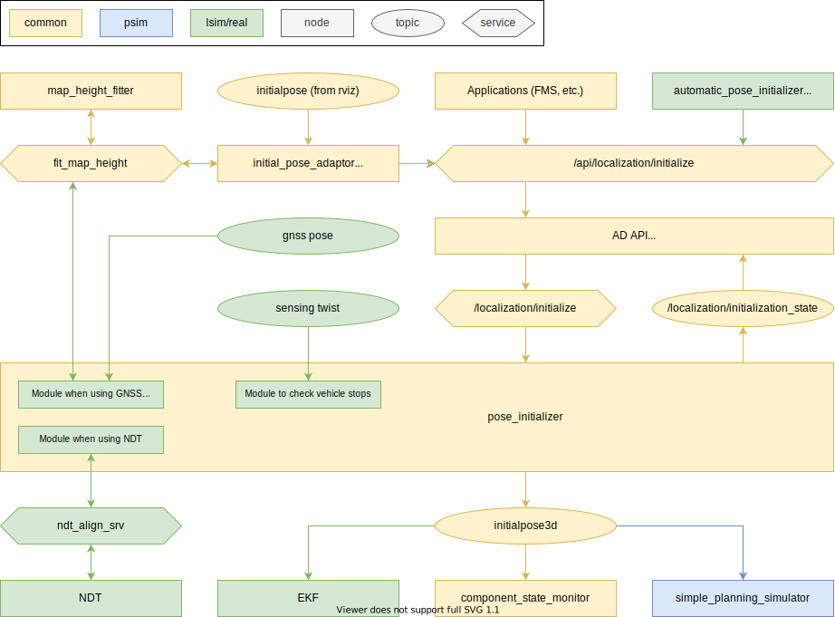

# Localization API

## Overview

Unify the location initialization method to the service. The topic `/initialpose` from rviz is now only subscribed to by adapter node and converted to API call. This API call is forwarded to the pose initializer node so it can centralize the state of pose initialization. For other nodes that require initialpose, pose initializer node publishes as `/initialpose3d`. See the [autoware-documentation](https://autowarefoundation.github.io/autoware-documentation/main/design/autoware-interfaces/ad-api/features/localization/) for AD API specifications.

