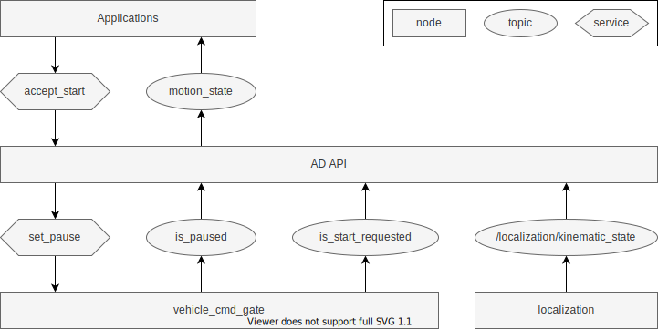

# Motion API

## Overview

Provides a hook for when the vehicle starts. It is typically used for announcements that call attention to the surroundings. Add a pause function to the vehicle_cmd_gate, and API will control it based on vehicle stopped and start requested. See the [autoware-documentation](https://autowarefoundation.github.io/autoware-documentation/main/design/autoware-interfaces/ad-api/list/api/motion/) for AD API specifications.

## States

The implementation has more detailed state transitions to manage pause state synchronization. The correspondence with the AD API state is as follows.

