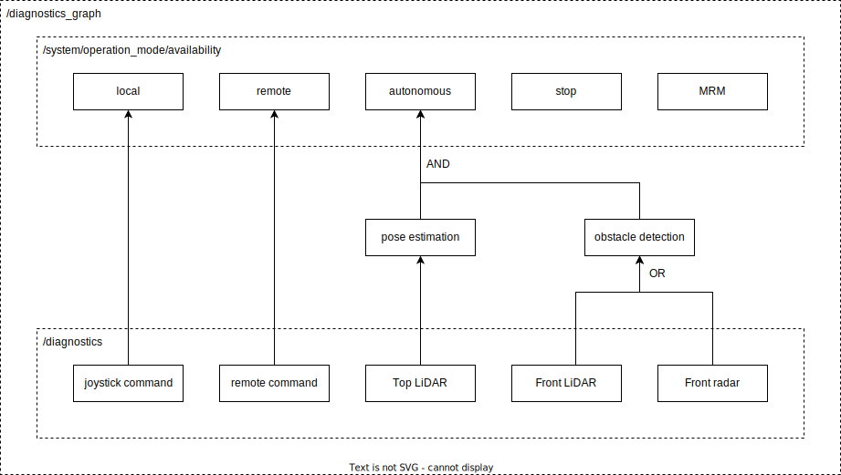

# diagnostic_graph_aggregator

## Overview

The diagnostic graph aggregator node subscribes to diagnostic array and publishes aggregated diagnostic graph.
As shown in the diagram below, this node introduces extra diagnostic status for intermediate functional units.



## Diagnostic graph structures

The diagnostic graph is actually a set of fault tree analysis (FTA) for each operation mode of Autoware.
Since the status of the same node may be referenced by multiple nodes, the overall structure is a directed acyclic graph (DAG).
Each node in the diagnostic graph represents the diagnostic status of a specific functional unit, including the input diagnostics.
So we define this as "unit", and call the unit corresponding to the input diagnosis "diag unit" and the others "node unit".

Every unit has an error level that is the same as DiagnosticStatus, a unit type, and optionally a unit path.
In addition, every diag unit has a message, a hardware_id, and values that are the same as DiagnosticStatus.
The unit type represents how the unit status is calculated, such as AND or OR.
The unit path is any unique string that represents the functionality of the unit.

NOTE: This feature is currently under development.
The diagnostic graph also supports "link" because there are cases where connections between units have additional status.
For example, it is natural that many functional units will have an error status until initialization is complete.

## Operation mode availability

For MRM, this node publishes the status of the top-level functional units in the dedicated message.
Therefore, the diagnostic graph must contain functional units with the following names.
This feature breaks the generality of the graph and may be changed to a plugin or another node in the future.

- /autoware/operation/stop
- /autoware/operation/autonomous
- /autoware/operation/local
- /autoware/operation/remote
- /autoware/operation/emergency-stop
- /autoware/operation/comfortable-stop
- /autoware/operation/pull-over

## Interfaces

| Interface Type | Interface Name                        | Data Type                                         | Description                        |
| -------------- | ------------------------------------- | ------------------------------------------------- | ---------------------------------- |
| subscription   | `/diagnostics`                        | `diagnostic_msgs/msg/DiagnosticArray`             | Diagnostics input.                 |
| publisher      | `/diagnostics_graph/unknowns`         | `diagnostic_msgs/msg/DiagnosticArray`             | Diagnostics not included in graph. |
| publisher      | `/diagnostics_graph/struct`           | `tier4_system_msgs/msg/DiagGraphStruct`           | Diagnostic graph (static part).    |
| publisher      | `/diagnostics_graph/status`           | `tier4_system_msgs/msg/DiagGraphStatus`           | Diagnostic graph (dynamic part).   |
| publisher      | `/system/operation_mode/availability` | `tier4_system_msgs/msg/OperationModeAvailability` | Operation mode availability.       |

## Parameters

| Parameter Name                    | Data Type | Description                                |
| --------------------------------- | --------- | ------------------------------------------ |
| `graph_file`                      | `string`  | Path of the config file.                   |
| `rate`                            | `double`  | Rate of aggregation and topic publication. |
| `input_qos_depth`                 | `uint`    | QoS depth of input array topic.            |
| `graph_qos_depth`                 | `uint`    | QoS depth of output graph topic.           |
| `use_operation_mode_availability` | `bool`    | Use operation mode availability publisher. |

## Examples

This is an example of a diagnostic graph configuration. The configuration can be split into multiple files.

- [main.yaml](./example/graph/main.yaml)
- [module1.yaml](./example/graph/module1.yaml)
- [module2.yaml](./example/graph/module2.yaml)

```bash
ros2 launch diagnostic_graph_aggregator example-main.launch.xml
```

You can reuse the graph by making partial edits. For example, disable hardware checks for simulation.

- [edit.yaml](./example/graph/edit.yaml)

```bash
ros2 launch diagnostic_graph_aggregator example-edit.launch.xml
```

## Debug tools

- [tree](./doc/tool/tree.md)
- [diagnostic_graph_utils](../diagnostic_graph_utils/README.md)

## Graph file format

- [graph](./doc/format/graph.md)
- [path](./doc/format/path.md)
- [unit](./doc/format/unit.md)
- [edit](./doc/format/edit.md)
