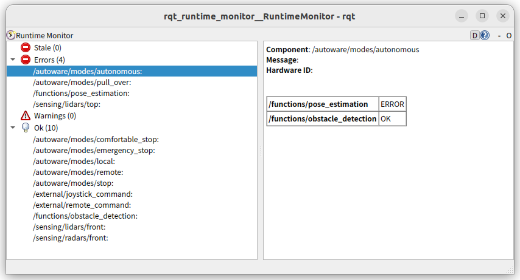
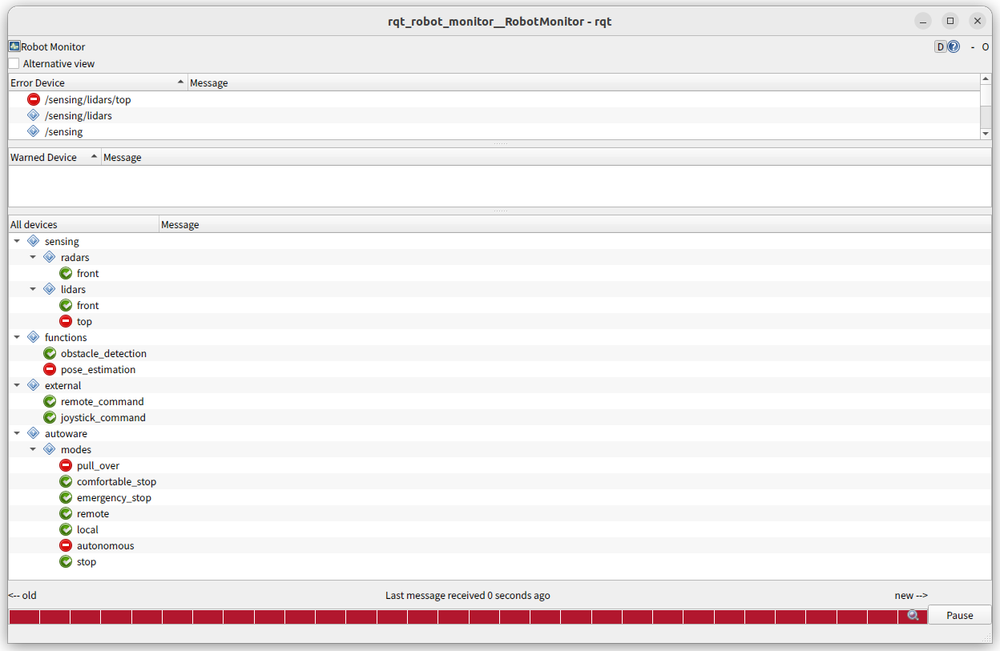

# Converter tool

This tool converts `/diagnostics_graph` to `/diagnostics_agg` so it can be read by tools such as `rqt_runtime_monitor` and `rqt_robot_monitor`.

## Usage

```bash
ros2 launch diagnostic_graph_aggregator converter.launch.xml complement:=false
```

The `complement` argument specifies whether to add an intermediate path that does not exist.
This means that if the graph contains paths `/A/B` and `/A/B/C/D/E`, the intermediate paths `/A`, `/A/B/C` and `/A/B/C/D` will be added.
This is useful for tree view in `rqt_robot_monitor`. The completed node has an error level of `STALE`.

## Examples

```bash
ros2 launch diagnostic_graph_aggregator example-main.launch.xml complement:=false
ros2 run rqt_runtime_monitor rqt_runtime_monitor --ros-args -r diagnostics:=diagnostics_agg
```



```bash
ros2 launch diagnostic_graph_aggregator example-main.launch.xml complement:=true
ros2 run rqt_robot_monitor rqt_robot_monitor
```


