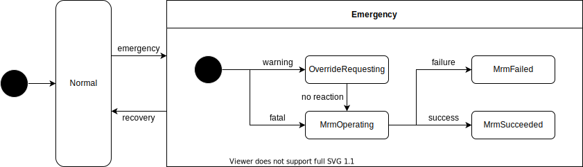

# emergency_handler

## Purpose

Emergency Handler is a node to select proper MRM from from system failure state contained in HazardStatus.

## Inner-workings / Algorithms

### State Transitions

## Inputs / Outputs

### Input

| Name                                      | Type                                                       | Description                                                                   |
| ----------------------------------------- | ---------------------------------------------------------- | ----------------------------------------------------------------------------- |
| `/system/emergency/hazard_status`         | `autoware_auto_system_msgs::msg::HazardStatusStamped`      | Used to select proper MRM from system failure state contained in HazardStatus |
| `/control/vehicle_cmd`                    | `autoware_auto_control_msgs::msg::AckermannControlCommand` | Used as reference when generate Emergency Control Command                     |
| `/localization/kinematic_state`           | `nav_msgs::msg::Odometry`                                  | Used to decide whether vehicle is stopped or not                              |
| `/vehicle/status/control_mode`            | `autoware_auto_vehicle_msgs::msg::ControlModeReport`       | Used to check vehicle mode: autonomous or manual                              |
| `/system/api/mrm/comfortable_stop/status` | `tier4_system_msgs::msg::MrmBehaviorStatus`                | Used to check if MRM comfortable stop operation is available                  |
| `/system/api/mrm/emergency_stop/status`   | `tier4_system_msgs::msg::MrmBehaviorStatus`                | Used to check if MRM emergency stop operation is available                    |

### Output

| Name                                       | Type                                                   | Description                                           |
| ------------------------------------------ | ------------------------------------------------------ | ----------------------------------------------------- |
| `/system/emergency/shift_cmd`              | `autoware_auto_vehicle_msgs::msg::GearCommand`         | Required to execute proper MRM (send gear cmd)        |
| `/system/emergency/hazard_cmd`             | `autoware_auto_vehicle_msgs::msg::HazardLightsCommand` | Required to execute proper MRM (send turn signal cmd) |
| `/api/fail_safe/mrm_state`                 | `autoware_adapi_v1_msgs::msg::MrmState`                | Inform MRM execution state and selected MRM behavior  |
| `/system/api/mrm/comfortable_stop/operate` | `tier4_system_msgs::srv::OperateMrm`                   | Execution order for MRM comfortable stop              |
| `/system/api/mrm/emergency_stop/operate`   | `tier4_system_msgs::srv::OperateMrm`                   | Execution order for MRM emergency stop                |

## Parameters

{{ json_to_markdown("system/emergency_handler/schema/emergency_handler.schema.json") }}

## Assumptions / Known limits

TBD.
