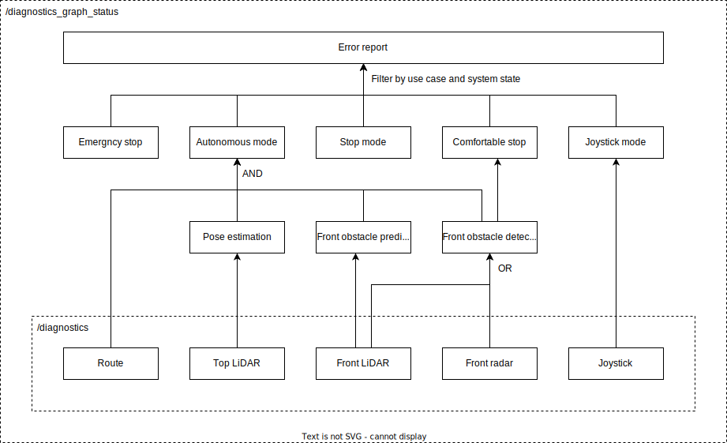

# System diagnostic graph

## Overview

The system diagnostic graph node subscribes to diagnostic array and publishes aggregated diagnostic graph.
As shown in the diagram below, this node introduces extra diagnostic status for intermediate functional unit.
Diagnostic status dependencies will be directed acyclic graph (DAG).



## Operation mode availability

For MRM, this node publishes the status of the top-level functional units in the dedicated message.
Therefore, the diagnostic graph must contain functional units with the following names.
This feature breaks the generality of the graph and may be changed to a plugin or another node in the future.

- /autoware/operation/stop
- /autoware/operation/autonomous
- /autoware/operation/local
- /autoware/operation/remote
- /autoware/operation/emergency-stop
- /autoware/operation/comfortable-stop
- /autoware/operation/pull-over

## Interface

| Interface Type | Interface Name                        | Data Type                                         | Description        |
| -------------- | ------------------------------------- | ------------------------------------------------- | ------------------ |
| subscription   | `/diagnostics`                        | `diagnostic_msgs/msg/DiagnosticArray`             | Diagnostics input. |
| publisher      | `/diagnostics_graph`                  | `tier4_system_msgs/msg/DiagnosticGraph`           | Diagnostics graph. |
| publisher      | `/system/operation_mode/availability` | `tier4_system_msgs/msg/OperationModeAvailability` | mode availability. |

## Parameters

| Parameter Name    | Data Type | Description                                |
| ----------------- | --------- | ------------------------------------------ |
| `graph_file`      | `string`  | Path of the config file.                   |
| `rate`            | `double`  | Rate of aggregation and topic publication. |
| `input_qos_depth` | `uint`    | QoS depth of input array topic.            |
| `graph_qos_depth` | `uint`    | QoS depth of output graph topic.           |

## Graph file format

- [GraphFile](./doc/format/graph-file.md)
- [Path](./doc/format/path.md)
- [Node](./doc/format/node.md)
  - [Diag](./doc/format/diag.md)
  - [Unit](./doc/format/unit.md)
  - [And](./doc/format/and.md)
  - [Or](./doc/format/or.md)

## Example

- [example1.yaml](./example/example1.yaml)
- [example2.yaml](./example/example2.yaml)

```bash
ros2 launch system_diagnostic_graph example.launch.xml
```
