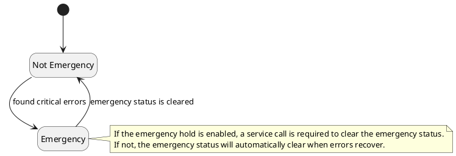
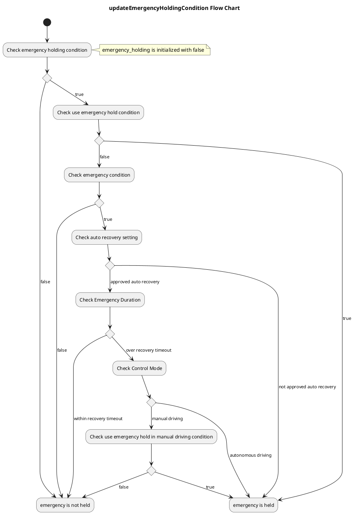

# system_error_monitor

## Purpose

Autoware Error Monitor has two main functions.

1. It is to judge the system hazard level from the aggregated diagnostic information of each module of Autoware.
2. It enables automatic recovery from the emergency state.

## Inner-workings / Algorithms

### State Transition

### updateEmergencyHoldingCondition Flow Chart

## Inputs / Outputs

### Input

| Name                         | Type                                                 | Description                                                                                                        |
| ---------------------------- | ---------------------------------------------------- | ------------------------------------------------------------------------------------------------------------------ |
| `/diagnostics_agg`           | `diagnostic_msgs::msg::DiagnosticArray`              | Diagnostic information aggregated based [diagnostic_aggregator setting](./config/diagnostic_aggregator) is used to |
| `/autoware/state`            | `autoware_auto_system_msgs::msg::AutowareState`      | Required to ignore error during Route, Planning and Finalizing.                                                    |
| `/control/current_gate_mode` | `tier4_control_msgs::msg::GateMode`                  | Required to select the appropriate module from `autonomous_driving` or `external_control`                          |
| `/vehicle/control_mode`      | `autoware_auto_vehicle_msgs::msg::ControlModeReport` | Required to not hold emergency during manual driving                                                               |

### Output

| Name                              | Type                                                  | Description                                                                          |
| --------------------------------- | ----------------------------------------------------- | ------------------------------------------------------------------------------------ |
| `/system/emergency/hazard_status` | `autoware_auto_system_msgs::msg::HazardStatusStamped` | HazardStatus contains system hazard level, emergency hold status and failure details |
| `/diagnostics_err`                | `diagnostic_msgs::msg::DiagnosticArray`               | This has the same contents as HazardStatus. This is used for visualization           |

## Parameters

### Node Parameters

| Name                         | Type   | Default Value | Explanation                                                                                                                                                            |
| ---------------------------- | ------ | ------------- | ---------------------------------------------------------------------------------------------------------------------------------------------------------------------- |
| `ignore_missing_diagnostics` | bool   | `false`       | If this parameter is turned off, it will be ignored if required modules have not been received.                                                                        |
| `add_leaf_diagnostics`       | bool   | `true`        | Required to use children diagnostics.                                                                                                                                  |
| `diag_timeout_sec`           | double | `1.0` (sec)   | If required diagnostic is not received for a `diag_timeout_sec`, the diagnostic state become STALE state.                                                              |
| `data_ready_timeout`         | double | `30.0`        | If input topics required for system_error_monitor are not available for `data_ready_timeout` seconds, autoware_state will translate to emergency state.                |
| `data_heartbeat_timeout`     | double | `1.0`         | If input topics required for system_error_monitor are not no longer subscribed for `data_heartbeat_timeout` seconds, autoware_state will translate to emergency state. |

### Core Parameters

| Name                                   | Type   | Default Value | Explanation                                                                                           |
| -------------------------------------- | ------ | ------------- | ----------------------------------------------------------------------------------------------------- |
| `hazard_recovery_timeout`              | double | `5.0`         | The vehicle can recovery to normal driving if emergencies disappear during `hazard_recovery_timeout`. |
| `use_emergency_hold`                   | bool   | `false`       | If it is false, the vehicle will return to normal as soon as emergencies disappear.                   |
| `use_emergency_hold_in_manual_driving` | bool   | `false`       | If this parameter is turned off, emergencies will be ignored during manual driving.                   |
| `emergency_hazard_level`               | int    | `2`           | If hazard_level is more than emergency_hazard_level, autoware state will translate to emergency state |

### YAML format for system_error_monitor

The parameter key should be filled with the hierarchical diagnostics output by diagnostic_aggregator. Parameters prefixed with `required_modules.autonomous_driving` are for autonomous driving. Parameters with the `required_modules.remote_control` prefix are for remote control. If the value is `default`, the default value will be set.

| Key                                                                 | Type   | Default Value | Explanation                                                                                                |
| ------------------------------------------------------------------- | ------ | ------------- | ---------------------------------------------------------------------------------------------------------- |
| `required_modules.autonomous_driving.DIAGNOSTIC_NAME.sf_at`         | string | `"none"`      | Diagnostic level where it becomes Safe Fault. Available options are `"none"`, `"warn"`, `"error"`.         |
| `required_modules.autonomous_driving.DIAGNOSTIC_NAME.lf_at`         | string | `"warn"`      | Diagnostic level where it becomes Latent Fault. Available options are `"none"`, `"warn"`, `"error"`.       |
| `required_modules.autonomous_driving.DIAGNOSTIC_NAME.spf_at`        | string | `"error"`     | Diagnostic level where it becomes Single Point Fault. Available options are `"none"`, `"warn"`, `"error"`. |
| `required_modules.autonomous_driving.DIAGNOSTIC_NAME.auto_recovery` | string | `"true"`      | Determines whether the system will automatically recover when it recovers from an error.                   |
| `required_modules.remote_control.DIAGNOSTIC_NAME.sf_at`             | string | `"none"`      | Diagnostic level where it becomes Safe Fault. Available options are `"none"`, `"warn"`, `"error"`.         |
| `required_modules.remote_control.DIAGNOSTIC_NAME.lf_at`             | string | `"warn"`      | Diagnostic level where it becomes Latent Fault. Available options are `"none"`, `"warn"`, `"error"`.       |
| `required_modules.remote_control.DIAGNOSTIC_NAME.spf_at`            | string | `"error"`     | Diagnostic level where it becomes Single Point Fault. Available options are `"none"`, `"warn"`, `"error"`. |
| `required_modules.remote_control.DIAGNOSTIC_NAME.auto_recovery`     | string | `"true"`      | Determines whether the system will automatically recover when it recovers from an error.                   |

## Assumptions / Known limits

TBD.
