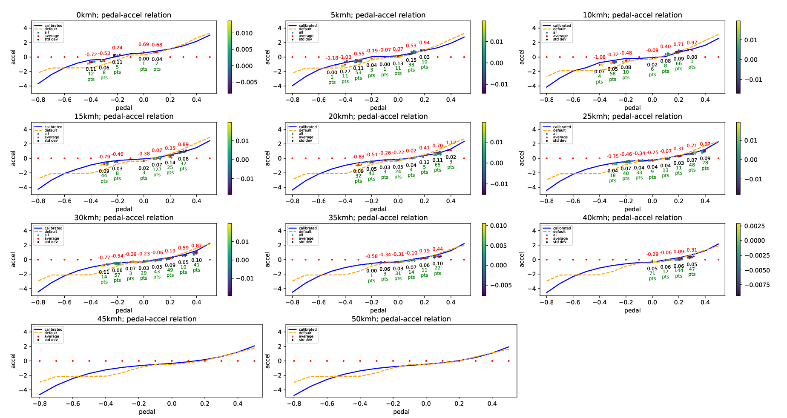

# accel_brake_map_calibrator

The role of this node is to automatically calibrate `accel_map.csv` / `brake_map.csv` used in the `raw_vehicle_cmd_converter` node.

The base map, which is lexus's one by default, is updated iteratively with the loaded driving data.

## How to calibrate

### Launch Calibrator

After launching Autoware, run the `accel_brake_map_calibrator` by the following command and then perform autonomous driving. Note: You can collect data with manual driving if it is possible to use the same vehicle interface as during autonomous driving (e.g. using a joystick).

```sh
ros2 launch accel_brake_map_calibrator accel_brake_map_calibrator.launch.xml rviz:=true
```

Or if you want to use rosbag files, run the following commands.

```sh
ros2 param set /use_sim_time true
ros2 bag play <rosbag_file> --clock
```

During the calibration with setting the parameter `progress_file_output` to true, the log file is output in [directory of *accel_brake_map_calibrator*]/config/ . You can also see accel and brake maps in [directory of *accel_brake_map_calibrator*]/config/accel_map.csv and [directory of *accel_brake_map_calibrator*]/config/brake_map.csv after calibration.

### Calibration plugin

The `rviz:=true` option displays the RViz with a calibration plugin as below.

<p align="center">

</p>

The current status (velocity and pedal) is shown in the plugin. The color on the current cell varies green/red depending on the current data is valid/invalid. The data that doesn't satisfy the following conditions are considered invalid and will not be used for estimation.

- The velocity and pedal conditions are within certain ranges from the index values.
- The steer value, pedal speed, pitch value, etc. are less than corresponding thresholds.
- The velocity is higher than a threshold.

Note: You don't need to worry about whether the current state is red or green during calibration. Just keep getting data until all the cells turn red.

The value of each cell in the map is gray at first, and it changes from blue to red as the number of valid data in the cell accumulates. It is preferable to continue the calibration until each cell of the map becomes close to red. In particular, the performance near the stop depends strongly on the velocity of 0 ~ 6m/s range and the pedal value of +0.2 ~ -0.4, range so it is desirable to focus on those areas.

### Diagnostics

The `accel brake map_calibrator` publishes diagnostics message depending on the calibration status.
Diagnostic type `WARN` indicates that the current accel/brake map is estimated to be inaccurate. In this situation, it is strongly recommended to perform a re-calibration of the accel/brake map.

| Status                  | Diagnostics Type | Diagnostics message                        | Description                                         |
| ----------------------- | ---------------- | ------------------------------------------ | --------------------------------------------------- |
| No calibration required | `OK`             | "OK"                                       |                                                     |
| Calibration Required    | `WARN`           | "Accel/brake map Calibration is required." | The accuracy of current accel/brake map may be low. |

This diagnostics status can be also checked on the following ROS topic.

```sh
ros2 topic echo /accel_brake_map_calibrator/output/update_suggest
```

When the diagnostics type is `WARN`, `True` is published on this topic and the update of the accel/brake map is suggested.

### Evaluation of the accel / brake map accuracy

The accuracy of map is evaluated by the **Root Mean Squared Error (RMSE)** between the observed acceleration and predicted acceleration.

**TERMS:**

- `Observed acceleration`: the current vehicle acceleration which is calculated as a derivative value of the wheel speed.

- `Predicted acceleration`: the output of the original accel/brake map, which the Autoware is expecting. The value is calculated using the current pedal and velocity.

You can check additional error information with the following topics.

- `/accel_brake_map_calibrator/output/current_map_error` : The error of the original map set in the `csv_path_accel/brake_map` path. The original map is not accurate if this value is large.
- `/accel_brake_map_calibrator/output/updated_map_error` : The error of the map calibrated in this node. The calibration quality is low if this value is large.
- `/accel_brake_map_calibrator/output/map_error_ratio` : The error ratio between the original map and updated map (ratio = updated / current). If this value is less than 1, it is desirable to update the map.

### How to visualize calibration data

The process of calibration can be visualized as below. Since these scripts need the log output of the calibration, the `pedal_accel_graph_output` parameter must be set to true while the calibration is running for the visualization.

#### Visualize plot of relation between acceleration and pedal

The following command shows the plot of used data in the calibration. In each plot of velocity ranges, you can see the distribution of the relationship between pedal and acceleration, and raw data points with colors according to their pitch angles.

```sh
ros2 run accel_brake_map_calibrator view_plot.py
```



#### Visualize statistics about acceleration/velocity/pedal data

The following command shows the statistics of the calibration:

- mean value
- standard deviation
- number of data

of all data in each map cell.

```sh
ros2 run accel_brake_map_calibrator view_statistics.py
```


### How to save the calibrated accel / brake map anytime you want

You can save accel and brake map anytime with the following command.

```sh
ros2 service call /accel_brake_map_calibrator/update_map_dir "path: '<accel/brake map directory>'"
```

You can also save accel and brake map in the default directory where Autoware reads accel_map.csv/brake_map.csv using the RViz plugin (AccelBrakeMapCalibratorButtonPanel) as following.

1. Click _Panels_ tab, and select AccelBrakeMapCalibratorButtonPanel.

   

2. Select the panel, and the button will appear at the bottom of RViz.

   

3. Press the button, and the accel / brake map will be saved.
   (The button cannot be pressed in certain situations, such as when the calibrator node is not running.)

   

## Parameters

| Name                     | Type   | Description                                                                                                                                                                       | Default value                                            |
| :----------------------- | :----- | :-------------------------------------------------------------------------------------------------------------------------------------------------------------------------------- | :------------------------------------------------------- |
| update_method            | string | you can select map calibration method. "update_offset_each_cell" calculates offsets for each grid cells on the map. "update_offset_total" calculates the total offset of the map. | "update_offset_each_cell"                                |
| get_pitch_method         | string | "tf": get pitch from tf, "none": unable to perform pitch validation and pitch compensation                                                                                        | "tf"                                                     |
| pedal_accel_graph_output | bool   | if true, it will output a log of the pedal accel graph.                                                                                                                           | true                                                     |
| progress_file_output     | bool   | if true, it will output a log and csv file of the update process.                                                                                                                 | false                                                    |
| default_map_dir          | str    | directory of default map                                                                                                                                                          | [directory of *raw_vehicle_cmd_converter*]/data/default/ |
| calibrated_map_dir       | str    | directory of calibrated map                                                                                                                                                       | [directory of *accel_brake_map_calibrator*]/config/      |
