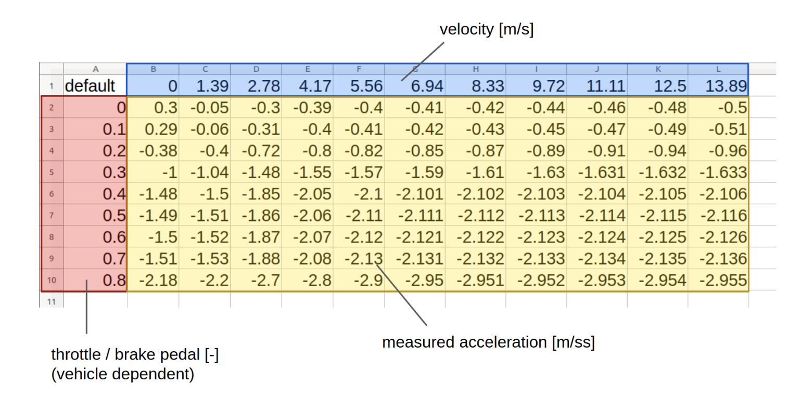
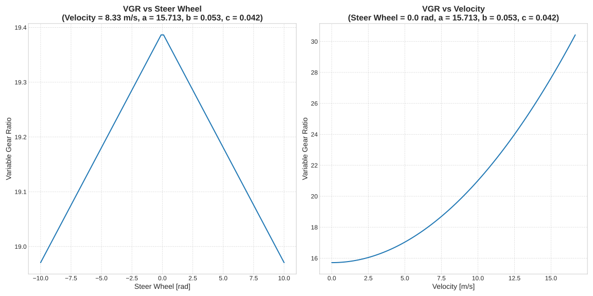

# autoware_raw_vehicle_cmd_converter

## Overview

The raw_vehicle_command_converter is a crucial node in vehicle automation systems, responsible for translating desired steering and acceleration inputs into specific vehicle control commands. This process is achieved through a combination of a lookup table and an optional feedback control system.

### Lookup Table

The core of the converter's functionality lies in its use of a CSV-formatted lookup table. This table encapsulates the relationship between the throttle/brake pedal (depending on your vehicle control interface) and the corresponding vehicle acceleration across various speeds. The converter utilizes this data to accurately translate target accelerations into appropriate throttle/brake values.



### Creation of Reference Data

Reference data for the lookup table is generated through the following steps:

1. **Data Collection**: On a flat road, a constant value command (e.g., throttle/brake pedal) is applied to accelerate or decelerate the vehicle.
2. **Recording Data**: During this phase, both the IMU acceleration and vehicle velocity data are recorded.
3. **CSV File Generation**: A CSV file is created, detailing the relationship between command values, vehicle speed, and resulting acceleration.

Once the acceleration map is crafted, it should be loaded when the RawVehicleCmdConverter node is launched, with the file path defined in the launch file.

### Auto-Calibration Tool

For ease of calibration and adjustments to the lookup table, an auto-calibration tool is available. More information and instructions for this tool can be found [here](https://github.com/autowarefoundation/autoware.universe/blob/main/vehicle/autoware_accel_brake_map_calibrator/README.md).

### Variable Gear Ratio (VGR)

This is a gear ratio for converting tire angle to steering angle. Generally, to improve operability, the gear ratio becomes dynamically larger as the speed increases or the steering angle becomes smaller. For a certain vehicle, data was acquired and the gear ratio was approximated by the following formula.

$$
a + b \times v^2 - c \times \lvert \delta \rvert
$$

For that vehicle, the coefficients were as follows.

```yaml
vgr_coef_a: 15.713
vgr_coef_b: 0.053
vgr_coef_c: 0.042
```



When `convert_steer_cmd_method: "vgr"` is selected, the node receives the control command from the controller as the desired tire angle and calculates the desired steering angle to output.
Also, when `convert_actuation_to_steering_status: true`, this node receives the `actuation_status` topic and calculates the steer tire angle from the `steer_wheel_angle` and publishes it.

## Input topics

| Name                       | Type                                       | Description                                                                                                                                                                                                                                                                                       |
| -------------------------- | ------------------------------------------ | ------------------------------------------------------------------------------------------------------------------------------------------------------------------------------------------------------------------------------------------------------------------------------------------------- |
| `~/input/control_cmd`      | autoware_control_msgs::msg::Control        | target `velocity/acceleration/steering_angle/steering_angle_velocity` is necessary to calculate actuation command.                                                                                                                                                                                |
| `~/input/steering"`        | autoware_vehicle_msgs::msg::SteeringReport | subscribe only when `convert_actuation_to_steering_status: false`. current status of steering used for steering feed back control                                                                                                                                                                 |
| `~/input/odometry`         | navigation_msgs::Odometry                  | twist topic in odometry is used.                                                                                                                                                                                                                                                                  |
| `~/input/actuation_status` | tier4_vehicle_msgs::msg::ActuationStatus   | actuation status is assumed to receive the same type of status as sent to the vehicle side. For example, if throttle/brake pedal/steer_wheel_angle is sent, the same type of status is received. In the case of steer_wheel_angle, it is used to calculate steer_tire_angle and VGR in this node. |

## Output topics

| Name                       | Type                                             | Description                                                                                                                          |
| -------------------------- | ------------------------------------------------ | ------------------------------------------------------------------------------------------------------------------------------------ |
| `~/output/actuation_cmd`   | tier4_vehicle_msgs::msg::ActuationCommandStamped | actuation command for vehicle to apply mechanical input                                                                              |
| `~/output/steering_status` | autoware_vehicle_msgs::msg::SteeringReport       | publish only when `convert_actuation_to_steering_status: true`. steer tire angle is calculated from steer wheel angle and published. |

## Parameters

{{ json_to_markdown("vehicle/autoware_raw_vehicle_cmd_converter/schema/raw_vehicle_cmd_converter.schema.json") }}

## Limitation

The current feed back implementation is only applied to steering control.
