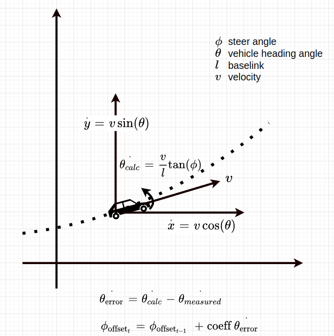

# steer_offset_estimator

## Purpose

The role of this node is to automatically calibrate `steer_offset` used in the `vehicle_interface` node.

The base steer offset value is 0 by default, which is standard, is updated iteratively with the loaded driving data. This module is supposed to be used in below straight driving situation.


## Inner-workings / Algorithms

Estimates sequential steering offsets from kinematic model and state observations.

Calculate yaw rate error and then calculate steering error recursively by least squared method, for more details see `updateSteeringOffset()` function.

## Inputs / Outputs

### Input

| Name            | Type                                              | Description   |
| --------------- | ------------------------------------------------- | ------------- |
| `~/input/twist` | `geometry_msgs::msg::TwistStamped`                | vehicle twist |
| `~/input/steer` | `autoware_auto_vehicle_msgs::msg::SteeringReport` | steering      |

### Output

| Name                                  | Type                                    | Description                   |
| ------------------------------------- | --------------------------------------- | ----------------------------- |
| `~/output/steering_offset`            | `tier4_debug_msgs::msg::Float32Stamped` | steering offset               |
| `~/output/steering_offset_covariance` | `tier4_debug_msgs::msg::Float32Stamped` | covariance of steering offset |

## Launch Calibrator

After launching Autoware, run the `steer_offset_estimator` by the following command and then perform autonomous driving. Note: You can collect data with manual driving if it is possible to use the same vehicle interface as during autonomous driving (e.g. using a joystick).

```sh
ros2 launch steer_offset_estimator steer_offset_estimator.launch.xml
```

Or if you want to use rosbag files, run the following commands.

```sh
ros2 param set /use_sim_time true
ros2 bag play <rosbag_file> --clock
```

## Parameters

| Params                  | Description                           |
| ----------------------- | ------------------------------------- |
| `steer_update_hz`       | update hz                             |
| `initial_covariance`    | steer offset is larger than tolerance |
| `forgetting_factor`     | weight of using previous value        |
| `valid_min_velocity`    | velocity below this value is not used |
| `valid_max_steer`       | steer above this value is not used    |
| `warn_steer_offset_deg` | warn if offset is above this value    |

## Diagnostics

The `steer_offset_estimator` publishes diagnostics message depending on the calibration status.
Diagnostic type `WARN` indicates that the current steer_offset is estimated to be inaccurate. In this situation, it is strongly recommended to perform a re-calibration of the steer_offset.

| Status                  | Diagnostics Type | Diagnostics message                     |
| ----------------------- | ---------------- | --------------------------------------- |
| No calibration required | `OK`             | "Preparation"                           |
| Calibration Required    | `WARN`           | "Steer offset is larger than tolerance" |

This diagnostics status can be also checked on the following ROS topic.

```sh
ros2 topic echo /vehicle/status/steering_offset
```
